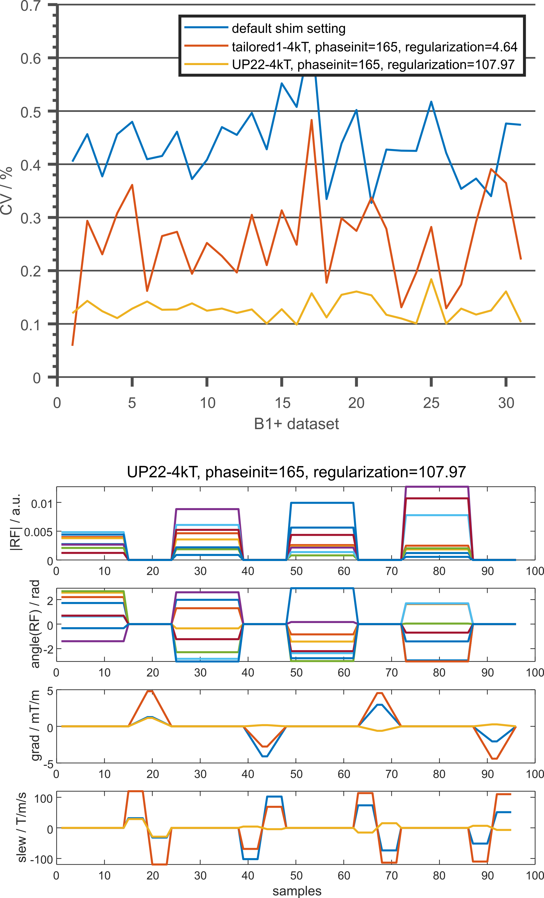

# UP_body

This repository contains a MATLAB implementation to load 31 channel-wise invivo B1+ datasets of the human body at 7T and to compute and evaluate tailored and universal pulses  in the human heart based on a library of 22 B1+ datasets and 9 unseen test cases as described in [1]. The channel-wise invivo B1+ datasets of the human body at 7T are available at: https://doi.org/10.6084/m9.figshare.14778345.v2 and were computed as described in [2].

##### Authors:
- Christoph S. Aigner  (<christoph.aigner@ptb.de>)
- Sebastian Dietrich   (<sebastian.dietrich@ptb.de>)
- Tobias Schäffter     (<tobias.schaeffter@ptb.de>)
- Sebastian Schmitter  (<sebastian.schmitter@ptb.de>)

Usage
--------

Run script main.m: This script takes the user through three pulse designs and evaluations that were also shown in [1]. This script shows three cases: 1) default shim setting: phase and equal magnitude set by the coil manufacturer to provide sufficient B1+ throughout the heart and the aorta (unseen test cases: 31), 2) tailored1-4kT: optimized for the B1+-dataset of subject 1 (library: 1, unseen test cases: 30), and 3) UP22-4kT: optimized for a library of 22 B1+-datasets (library: 22, unseen test cases: 9). The functions rely on B1 maps and ROIs available at https://doi.org/10.6084/m9.figshare.14778345.v2.

The pulse diagram shows the complex RF voltages (magnitude and phase) and 3D gradient blips of the UP22-4kT.

Contents
--------

##### Test scripts (run these):
    main.m          test script to compute and evaluate tailored and universal pulses at 7T

##### Routines called by the test scripts:
    cmap.mat            256x3 double matrix with the used colormap of the manuscript
    designTailored.m    function to compute tailored kT-point pulses
    designUP.m          function to compute universal kT-point pulses
    evalAllDatasets.m   function to evaluates default shim setting, tailored pulses and universal pulses
    getHeartCenter.m    function to get the heart position of each B1+ dataset
    loadB1R.m           function to load the B1+ maps and prepare the cell structures
    preparekTpoints.m   function to generate the RF and 3D gradient vectors for the measurement and perform a quality check
    kTrandphases.mat    200x8 double matrix with randomized phase initials
    
##### External data files used by the test scripts:
    B1R.zip          The 31 channel-wise invivo B1+ datasets of the human body at 7T are available at https://doi.org/10.6084/m9.figshare.14778345.v2
    
Dependencies
------------
These routines were tested under MATLAB R2019a under Windows, but should also run under older versions.

The 31 channel-wise invivo B1+ datasets of the human body at 7T are available at: https://doi.org/10.6084/m9.figshare.14778345.v2 and were computed as described in [2].

The optimization of the kT-points is performed using code by Will Grissom and Zhipeng Cao ([3,4] and https://bitbucket.org/wgrissom/acptx/) who have given permission for inclusion within this package. 

Please cite appropriately.

License
-------

This software is published under GNU GPLv3. 
In particular, all source code is provided "as is" without warranty of any kind, either expressed or implied. 
For details, see the attached LICENSE.

Reference
---------

[1] Aigner, CS, Dietrich, S, Schaeffter, T, Schmitter, S. Calibration-free pTx of the human heart at 7T via 3D universal pulses. Magn Reson Med. 2021; 00: 1– 15. https://doi.org/10.1002/mrm.28952

[2] Dietrich, S, Aigner, CS, Kolbitsch, C, et al. 3D Free-breathing multichannel absolute B1+ Mapping in the human body at 7T. Magn Reson Med. 2021; 85: 2552– 2567. https://doi.org/10.1002/mrm.28602

[3] Grissom, W.A., Khalighi, M.-M., Sacolick, L.I., Rutt, B.K. and Vogel, M.W. (2012), Small-tip-angle spokes pulse design using interleaved greedy and local optimization methods. Magn Reson Med, 68: 1553-1562. https://doi.org/10.1002/mrm.24165

[4] Cao, Z., Yan, X. and Grissom, W.A. (2016), Array-compressed parallel transmit pulse design. Magn. Reson. Med., 76: 1158-1169. https://doi.org/10.1002/mrm.26020

Created by Christoph S. Aigner, PTB, June 2021.
Email: christoph.aigner@ptb.de
